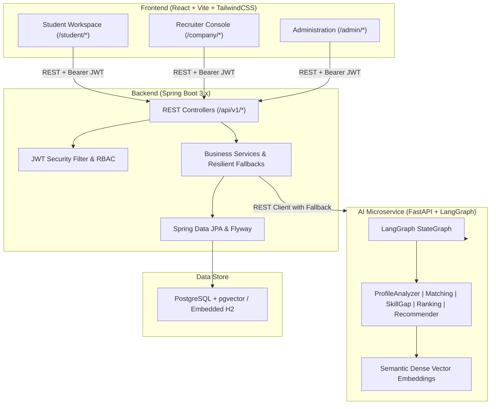

# Career Connectors - AI-Powered Talent & Opportunity Platform

[](https://spring.io/projects/spring-boot)
[](https://fastapi.tiangolo.com)
[](https://react.dev)
[](https://github.com/pgvector/pgvector)
[](https://tailwindcss.com)

**Career Connectors** is a production-grade, AI-powered full-stack platform that intelligently matches students with real-world work opportunities (internships, full-time jobs, and research fellowships). It features semantic vector skill matching, personalized recommendation feeds, skill-gap reasoning with actionable learning paths, and candidate ranking workflows.

---

## System Architecture



---

## Key Features

### 1. For Students
- **Smart Opportunity Discovery**: Search and filter opportunities by keyword, type (Internship, Full-time, Project), remote status, stipend, and skills.
- **Explainable Match Scoring**: Real-time 0-100% compatibility scores computed from dense vector embeddings and skill proficiency factors.
- **AI Skill-Gap Analysis & Roadmaps**: Analyzes missing and weak skills for any job posting and dynamically generates a personalized learning path with tutorials and practice projects.
- **AI Career Trajectory & Suggestions**: Strategic career guidance, readiness scores, trending industry skills, and recommended portfolio projects.
- **Interactive Application Tracker**: Visual multi-stage status progress bar (Applied &rarr; Under Review &rarr; Shortlisted &rarr; Selected / Archived).
- **Profile & Resume Extractor**: Manage verified skills and auto-extract technical competencies from resumes using AI NLP.

### 2. For Companies & Recruiters
- **Dynamic Job Posting**: Create opportunities with customized skill requirements, required proficiency levels, and AI weightages.
- **AI Candidate Ranking**: Automated multidimensional applicant ranking with compatibility breakdowns and explainability summaries.
- **Recruitment Funnel Management**: 1-click status transitions (Under Review, Shortlisted, Selected, Rejected).
- **Employer Branding & Verification**: Manage public profile, headquarters location, website, and upload official verification documents.

### 3. For Administrators
- **Platform Analytics Dashboard**: Platform-wide metrics, active posting counts, application status breakdown, and top skills in demand.
- **Student & Company Administration**: Search, moderate, activate, suspend, or delete user accounts.
- **Company Verification Queue**: Review submitted company credentials and approve or reject employer verification.
- **Opportunity Moderation**: Supervise and moderate posted roles across the platform.

---

## Out-of-the-Box Demo Credentials

| Role | Email | Password | Details |
| :--- | :--- | :--- | :--- |
| **Student** | `alex.chen@university.edu` | `password123` | CS Senior (Java, Spring Boot, React, Postgres) |
| **Student** | `maya.patel@stanford.edu` | `password123` | AI Specialist (Python, PyTorch, FastAPI, ML) |
| **Company** | `recruiter@nexusai.com` | `password123` | Nexus AI Technologies (Verified) |
| **Company** | `hiring@cloudscale.io` | `password123` | CloudScale Systems (Verified) |
| **Admin** | `admin@careerconnectors.io` | `admin123` | Super Administrator |

---

## Getting Started Locally

### Prerequisites
- **Java 17+** (JDK 17, 21, or 25)
- **Node.js 18+** & `npm`
- **Python 3.10+** & `pip`
- **PostgreSQL 14+** (Local service on port `5432` or via Docker)

---

### Local PostgreSQL Setup

1. **Create Database in Local PostgreSQL**:
   Open `psql` or pgAdmin / DBeaver and run:
   ```sql
   CREATE DATABASE career_connectors;
   ```

2. **Configure Environment Variables**:
   Copy `.env.example` to `.env` or set your credentials in `.env` / `backend/.env`:
   ```env
   DB_HOST=localhost
   DB_PORT=5432
   DB_NAME=career_connectors
   DB_USERNAME=postgres
   DB_PASSWORD=your_postgres_password
   ```

---

### Running Services Individually (Development Mode)

#### 1. AI Microservice (FastAPI)
```bash
cd ai-service
pip install -r requirements.txt
python -m uvicorn app.main:app --host 0.0.0.0 --port 8000 --reload
```

#### 2. Backend (Spring Boot 3)
```powershell
cd backend
# Runs in dev profile connected to local PostgreSQL with automatic Flyway schema migrations and data seeding:
.\mvnw.cmd spring-boot:run
```
*(Note: To run in offline mode using in-memory H2 without PostgreSQL, use `.\mvnw.cmd spring-boot:run -Dspring-boot.run.profiles=h2`)*

#### 3. Frontend (React + Vite)
```bash
cd frontend
npm install
npm run dev
```
Open [http://localhost:5173](http://localhost:5173) in your browser.

---

### Method B: Running with Docker Compose

```bash
docker compose up --build
```
Access the applications:
- **Frontend UI**: [http://localhost:3000](http://localhost:3000)
- **Spring Boot Backend**: [http://localhost:8080](http://localhost:8080)
- **FastAPI AI Microservice**: [http://localhost:8000/docs](http://localhost:8000/docs)
- **Swagger UI**: [http://localhost:8080/swagger-ui.html](http://localhost:8080/swagger-ui.html)

---

## API Endpoints Reference

### Authentication (`/api/v1/auth`)
- `POST /register/student` - Register student candidate
- `POST /register/company` - Register recruiter company
- `POST /login` - Login with credentials (returns JWT token)
- `GET /me` - Retrieve current authenticated user profile
- `POST /logout` - Stateless token invalidation

### Opportunities (`/api/v1/opportunities`)
- `GET /` - Search, filter, and paginate open opportunities
- `GET /{id}` - Get full opportunity specification & match breakdown

### Student Hub (`/api/v1/student`)
- `GET /profile` - Retrieve student profile
- `PUT /profile` - Update student profile
- `GET /skills` - List verified student skills
- `POST /skills` - Add new skill (Manual or AI-Extracted)
- `DELETE /skills/{id}` - Delete skill
- `PATCH /skills/{id}/proficiency` - Update proficiency level

### Applications (`/api/v1/applications`)
- `POST /` - Submit application for an opportunity
- `GET /my` - List student's submitted applications
- `GET /opportunity/{id}` - List applicants for an opportunity (Company/Admin)
- `PATCH /{id}/status` - Update applicant status (Under Review &rarr; Shortlist &rarr; Select &rarr; Reject)

### AI Services (`/api/v1/ai`)
- `GET /matching/{opportunityId}` - Real-time AI match score
- `GET /recommendations` - Curated opportunity recommendation feed
- `GET /skill-gap/{opportunityId}` - AI skill gap analysis & learning roadmap
- `GET /applicant-ranking/{opportunityId}` - AI multidimensional applicant ranking
- `GET /career-suggestions` - Strategic career paths & project ideas
- `POST /feedback` - Thumbs up/down feedback loop on recommendation quality

### Administration (`/api/v1/admin`)
- `GET /stats` - Platform analytics & high-demand skill metrics
- `GET /students` - Manage all student accounts
- `PATCH /users/{id}/status` - Suspend or activate user account
- `GET /companies` - Review employer directory
- `PATCH /companies/{id}/verify` - Approve or reject company verification
- `GET /opportunities` - Platform-wide postings moderation
